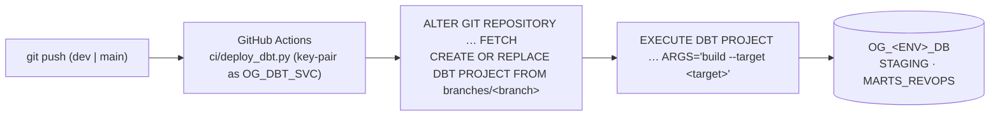
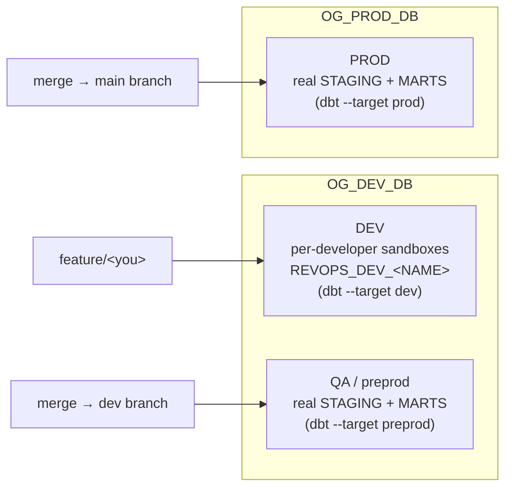

# CI/CD — how dbt deploys to Snowflake

dbt runs **natively in Snowflake**, so CI is a thin trigger: point a
`DBT PROJECT` object at the pushed branch and `EXECUTE` the build in-account.
No dbt-core runner builds the models.

## Environments — which env is DEV / QA / PROD

- **DEV** and **QA/preprod** both live in `OG_DEV_DB` — dev is your isolated
  sandbox; preprod is the shared integration build on merge to `dev`.
- **PROD** is `OG_PROD_DB`, built on merge to `main` (protected environment).

## Auto-deploy on push — [`.github/workflows/deploy.yml`](../.github/workflows/deploy.yml)

| Push to | Target | Database |
|---------|--------|----------|
| `dev`  | `preprod` | `OG_DEV_DB` |
| `main` | `prod`    | `OG_PROD_DB` |

Runs `ci/deploy_dbt.py --branch <branch>`, which connects as `OG_DBT_SVC`
(`REVOPS_DEVELOPER`, key-pair from GitHub secrets), fetches the git repo,
refreshes the `DBT PROJECT`, and executes `build --target <target>`. The `main`
job uses a protected `prod` GitHub Environment (approval gate).

## Full-refresh — [`.github/workflows/full-refresh.yml`](../.github/workflows/full-refresh.yml)

Manually triggered. Incremental models only merge **new** rows on a normal
deploy, so a logic fix never re-cleans already-materialized rows — this rebuilds
them (`--full-refresh`).

**Run it:** GitHub → **Actions → "dbt full-refresh (manual)" → Run workflow** →
pick inputs. Or `gh workflow run full-refresh.yml --ref main -f branch=<> -f scope=<>`.

| Input | Values | Meaning |
|-------|--------|---------|
| `branch` | `dev` (→ preprod / `OG_DEV_DB`), `main` (→ prod / `OG_PROD_DB`) | which env |
| `scope` | `all` | full-refresh **every** model |
| | `modified` | full-refresh only models whose `.sql` changed in the last commit (`git diff HEAD~1..HEAD` → `--select`) |

## Security

- **Key-pair auth**, secrets from GitHub Environments — never committed. The
  private key is written to a temp file only inside the job.
- Deploy jobs run on `push` to `dev`/`main` (post-merge), so a malicious PR can't
  reach the secrets. Prod is further gated by the `prod` Environment approval.
- Native execution keeps the build inside Snowflake under `REVOPS_DEVELOPER` —
  the CI runner never holds broad Snowflake privileges.

## First-time PROD setup (once per env)

The PROD `DBT PROJECT`'s git repo must exist:
`CREATE GIT REPOSITORY OG_PROD_DB.DBT.OG_DBT_HUB_REPO API_INTEGRATION=OG_GIT_API
ORIGIN='https://github.com/akashpahilwan/opengov-dbt-hub.git'`, owned by
`REVOPS_DEVELOPER`. `deploy_dbt.py` then `CREATE OR REPLACE`s the project each run.
