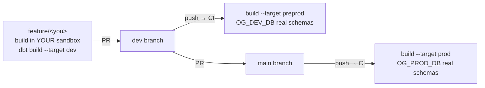

# Developer workflow — branch → sandbox → preprod → prod

## How isolation works

Each developer has a composite role `DEV_<NAME>` = `REVOPS_READER` (read all) +
their own sandbox write (`AR_DEV_REVOPS_DEV_<NAME>_W`), as their single default
role with **secondary roles disabled**. So:

- You can **read** every shared layer, **write** only `REVOPS_DEV_<NAME>`.
- Two developers never collide — separate sandboxes, `<schema>__<model>` naming.
- You can't touch shared `STAGING`/`MARTS` or anything in prod. Those writes
  happen only through the dbt CI service user (`OG_DBT_SVC` = `REVOPS_DEVELOPER`).
- Financials are masked for you in dev (you're a reader) — see them in
  preprod/prod builds.

## The loop

1. **Branch** off `dev`: `git checkout -b feature/<you>-<thing>`.
2. **Develop** locally into your sandbox (`--target dev`) — see
   [local development](local-development.md). Or use a Snowsight **Workspace**
   on your branch (uses your logged-in identity; branch switch is in the git panel).
3. **Test**: `dbt test --target dev --profiles-dir .`.
4. **PR into `dev`.** On merge, CI builds `--target preprod` into `OG_DEV_DB`'s
   real schemas (integration check with real financials + governance tags).
5. **PR `dev` → `main`.** On merge, CI builds `--target prod` into `OG_PROD_DB`.

## Naming strategy (why `<schema>__<model>` in dev but clean names in prod)

`generate_schema_name` / `generate_alias_name` macros:
- **dev** → everything in your sandbox schema, prefixed `<schema>__<model>`.
- **preprod / prod** → real schema (`STAGING`/`MARTS_REVOPS`), model `alias`
  (e.g. `mart_revops__pipeline` → `revops_pipeline`).

## Incremental models & full-refresh

Staging models are incremental (merge). A normal build only merges **new** rows,
so a **logic change** to an incremental model doesn't re-clean already-materialized
rows. Use the [manual full-refresh workflow](ci-cd.md#full-refresh) (or
`dbt build --select <model> --full-refresh`) to rebuild.
